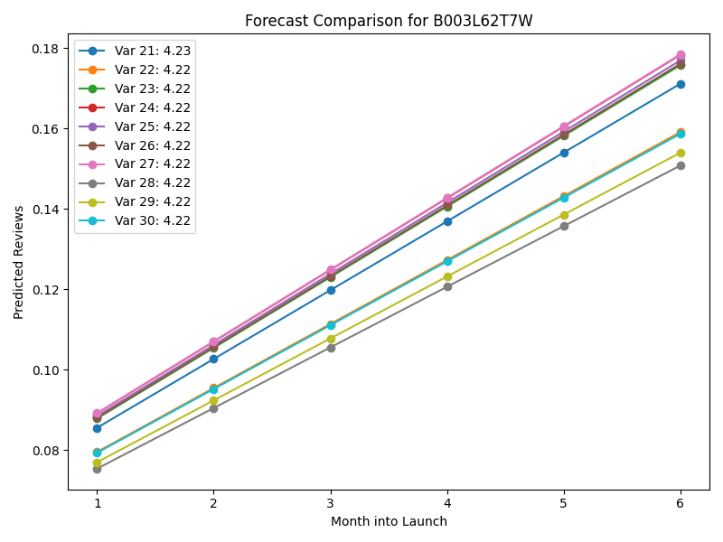

# Product Innovation Sequence  

## Overview  
Borrowing drug-discovery workflows to systematically predict and screen new consumer-product variants.

---

## Data  
- **amazon.csv**: raw review-level exports  
- **cleaned_reviews.parquet**: post-cleaning review data  
- **products.parquet**: aggregated product statistics  
- **features.parquet**: model-ready feature table  
- **top_candidates_all.csv**: screened in-silico variants  

---

## Scripts  
1. `data_cleaning.py`  
   - **Input:** `amazon.csv`  
   - **Output:** `cleaned_reviews.parquet`  
   - **Purpose:** parse timestamps, drop duplicates, filter reviews  

2. `aggregate_products.py`  
   - **Input:** `cleaned_reviews.parquet`  
   - **Output:** `products.parquet`  
   - **Purpose:** compute per-product stats (avg_rating, total_reviews, price_range, etc.)  

3. `feature_engineering.py`  
   - **Input:** `products.parquet`  
   - **Output:** `features.parquet`  
   - **Purpose:** one-hot encode categories, scale numeric features, create derived metrics  

4. `model_training.py`  
   - **Input:** `features.parquet`  
   - **Output:** `rf_model.joblib`, `metrics.json`  
   - **Purpose:** train RandomForest regressor, compute train/val RMSE & MAE  

5. `screen_and_compare_all.py`  
   - **Input:** `features.parquet`, `rf_model.joblib`  
   - **Output:** `top_candidates_all.csv`, `charts_html/forecast_comparison_<id>.html`  
   - **Purpose:** generate product variants, predict ratings, screen top candidates, produce interactive forecasts  

6. `inspect_importance.py`  
   - **Input:** `rf_model.joblib`, `features.parquet`  
   - **Output:** `images/feature_importances.png`  
   - **Purpose:** plot RandomForest feature importances  

7. `shap_explainability.py`  
   - **Input:** `rf_model.joblib`, `features.parquet`  
   - **Output:** `images/shap_summary.png`  
   - **Purpose:** compute SHAP values and render summary plot  

8. `analysis.ipynb`  
   - **Inputs:** final artifacts + images  
   - **Outputs:** interactive notebook with tables and embedded charts  

9. `app.py`  
   - **Inputs:** all artifacts + `metrics.json`  
   - **Outputs:** Streamlit dashboard  

---

## Results  

### Feature Importances  
  

### SHAP Global Summary  
  

### Forecast Comparison Example  
  

---

## How to Run  

```bash
# 1. Create & activate virtual environment
python -m venv venv
# Windows:
.\venv\Scripts\activate
# macOS/Linux:
source venv/bin/activate

# 2. Install dependencies
pip install -r requirements.txt

# 3. Execute pipeline end-to-end
python data_cleaning.py
python aggregate_products.py
python feature_engineering.py
python model_training.py
python screen_and_compare_all.py
python inspect_importance.py
python shap_explainability.py

# 4. Launch dashboard
python -m streamlit run app.py


product_Innovation/
├─ amazon.csv
├─ data_cleaning.py
├─ aggregate_products.py
├─ feature_engineering.py
├─ model_training.py
├─ screen_and_compare_all.py
├─ inspect_importance.py
├─ shap_explainability.py
├─ analysis.ipynb
├─ app.py
├─ requirements.txt
├─ metrics.json
├─ products.parquet
├─ features.parquet
├─ top_candidates_all.csv
├─ rf_model.joblib
├─ images/
│  ├─ feature_importances.png
│  ├─ shap_summary.png
│  └─ forecast_comparison_<id>.png
└─ charts_html/
   └─ forecast_comparison_<id>.html